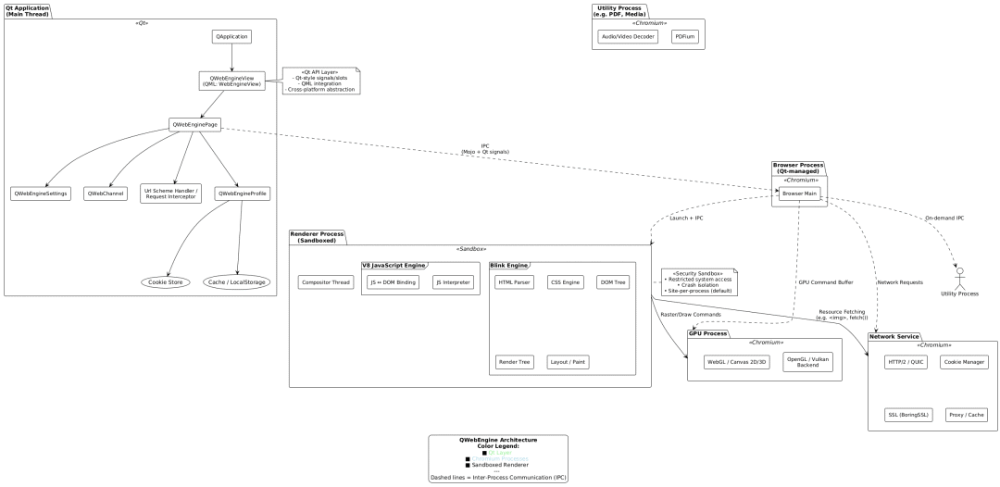

## QWebEngine 是什么？与 Chromium 的关系解析

## **1. 概述：QWebEngine 是什么？**

**QWebEngine** 是 Qt 框架中用于嵌入现代 Web 内容的核心模块，自 Qt 5.4（2014年）起正式引入，取代了旧版的 `QtWebKit`。它基于 **Chromium** 项目构建，为 Qt 应用程序提供高性能、安全、标准兼容的网页渲染能力。

简而言之：

> ✅ **QWebEngine = Qt API 封装层 + Chromium Content 层（精简版）**

它不是一个独立的浏览器引擎，而是一个**深度集成 Chromium 渲染与网络能力的 Qt 原生组件**。

------

## **2. 与 Chromium 的关系：不是“使用”，而是“嵌入”**

很多人误以为 QWebEngine “调用 Chromium 浏览器”，实则不然。其关系更准确地描述为：

| 项目                     | 说明                                                         |
| :----------------------- | :----------------------------------------------------------- |
| **Chromium**             | Google 主导的开源浏览器项目，包含 Blink 渲染引擎、V8 JavaScript 引擎、网络栈、GPU 加速、沙箱等完整组件。 |
| **Chromium Content API** | Chromium 提供的一组稳定接口层（`content/` 模块），允许第三方“嵌入”浏览器内核，而不依赖完整 Chrome UI。 |
| **QWebEngine**           | Qt 团队基于 Chromium 的 **Content API** 进行二次封装，暴露为 Qt 风格的 C++ 和 QML API（如 `QWebEngineView`, `QWebEnginePage`），屏蔽底层复杂性。 |

📌 **关键点**：

- QWebEngine **不依赖已安装的 Chrome/Chromium 浏览器**，所有依赖（Blink、V8、网络、GPU）均静态/动态链接进应用（或作为独立进程运行）。
- Qt 使用的 Chromium 版本**滞后于主线**（出于稳定性和 LTS 考虑），例如：
  - Qt 6.7 → Chromium 118
  - Qt 6.5 → Chromium 112

（可通过 `qDebug() << QWebEngineSettings::defaultSettings()->chromiumVersion();` 查询）

### **各进程职责**

| 进程                 | 功能                                                         | 是否可配置                         |
| :------------------- | :----------------------------------------------------------- | :--------------------------------- |
| **Browser Process**  | 主控进程：管理窗口、导航、cookie、存储、插件策略等；与 Qt 应用主线程交互。 | 可选择嵌入主进程（默认）或独立运行 |
| **Renderer Process** | 渲染网页内容：HTML 解析、CSS 计算、JS 执行、绘制指令生成；**严格沙箱隔离**，崩溃不影响主应用。 | 默认每站点独立；可配置进程模型     |
| **GPU Process**      | 处理 WebGL、Canvas、CSS 3D 等 GPU 加速任务；避免渲染进程直接访问 GPU。 | 默认启用                           |
| **Network Service**  | 统一网络栈：HTTP/2、QUIC、Cookie 管理、缓存、代理；从 Chromium 71 起独立为服务进程。 | Qt 6+ 默认启用                     |
| **Utility Process**  | 执行辅助任务：PDF 渲染、媒体解码、文件系统访问等。           | 按需启动                           |

> 🔐 **安全设计**：Renderer 进程无权直接访问文件系统、网络或用户数据——所有敏感操作必须通过 Browser 进程 IPC 委托，实现最小权限原则。

------

## **4. 为什么 Qt 要封装 Chromium？—— 技术动因与战略考量**

### **4.1 替代 QtWebKit 的必然选择**

- **QtWebKit** 基于老版 WebKit（Apple Safari 引擎分支），2013 年后上游停止维护。
- Web 标准演进迅猛（ES6+、WebAssembly、WebGL 2.0），WebKit 社区版难以跟进。
- Google 主导的 Blink/V8 生态更活跃，性能与兼容性显著领先。

### **4.2 开发者体验统一：Qt 风格 API**

直接使用 Chromium Content API 极其复杂（C++ 模板繁多、生命周期管理严苛）。Qt 的封装做到：

- ✅ **信号槽集成**：`loadFinished()`, `urlChanged()`, `javascriptConsoleMessage()` 等天然支持 Qt 事件循环。
- ✅ **QML 无缝支持**：`WebEngineView` 可直接嵌入 QML 界面，支持声明式布局与动画。
- ✅ **跨平台一致**：Windows/macOS/Linux/Embedded Linux 均使用同一套 API；Qt 处理平台差异（如沙箱策略、GPU 初始化）。
- ✅ **资源嵌入支持**：可通过 `QWebEngineUrlSchemeHandler` 拦截 `qrc://` 或自定义协议，实现离线 Web 资源加载。

### **4.3 企业级可控性与合规性**

- **版本锁定**：企业可选定 LTS 版本（如 Qt 6.5 + Chromium 112），避免 Chrome 自动更新带来的兼容风险。
- **裁剪定制**：Qt 可移除 Chromium 中非必要组件（如 Google 服务、DRM 模块），缩小二进制体积（典型嵌入式节省 30–50 MB）。
- **安全补丁同步**：Qt 团队会 backport Chromium 的关键 CVE 修复到 LTS 分支，无需等待上游全量升级。

### **4.4 与原生 Qt 生态深度整合**

| 能力                  | 实现方式                                                     |
| :-------------------- | :----------------------------------------------------------- |
| **混合渲染**          | `QQuickWebEngineView` 可作为 Qt Quick 3D 场景中的纹理；支持透明背景叠加原生控件 |
| **JS ↔ C++ 双向通信** | `QWebChannel`：将 QObject 暴露给 JS，实现 `window.myObject.method()` 调用 C++ |
| **打印与 PDF 导出**   | `QWebEnginePage::printToPdf()` 直接生成高质量 PDF，无需外部工具 |
| **DevTools 远程调试** | 启用 `--remote-debugging-port` 后，可用 Chrome DevTools 调试嵌入页面 |

------

## **5. 适用场景分析**

| 场景                                             | 是否推荐         | 理由                                                         |
| :----------------------------------------------- | :--------------- | :----------------------------------------------------------- |
| **桌面应用内嵌帮助文档/仪表盘**                  | ✅ 强烈推荐       | 开发效率高；支持响应式设计；可复用 Web 前端团队资源          |
| **电子白板/信息展示屏（kiosk 模式）**            | ✅ 推荐           | 全屏 API + 进程隔离保障稳定性；支持 WebGL 数据可视化         |
| **跨平台混合应用（Web + 原生）**                 | ✅ 推荐           | QWebChannel 实现无缝桥接；比 Cordova/Electron 更轻量（无 Node.js 运行时） |
| **高性能游戏/3D 应用主界面**                     | ⚠️ 谨慎评估       | Web 渲染有开销；复杂交互建议用 Qt Quick；可局部嵌入 WebGL 内容 |
| **资源极度受限的嵌入式设备（<512MB RAM）**       | ❌ 不推荐         | Chromium 多进程模型内存占用较高；考虑 `QtWebKit`（遗留）或轻量 WebView（如 Android WebView + Qt for Android） |
| **需深度定制浏览器行为（如广告拦截、协议扩展）** | ✅ 可行，但需深入 | 需子类化 `QWebEngineUrlRequestInterceptor` / `QWebEngineUrlSchemeHandler`；复杂逻辑建议用 CEF 或直接 Chromium Embedded Framework |

------

## **6. 争议与局限：没有银弹**

尽管强大，QWebEngine 仍有以下限制需注意：

| 问题             | 说明                                                        | 缓解方案                                                     |
| :--------------- | :---------------------------------------------------------- | :----------------------------------------------------------- |
| **二进制体积大** | Release 包含 Chromium 后通常增加 60–120 MB                  | 使用 `strip`、LTO 编译；仅链接必要模块（Qt 6.5+ 支持组件裁剪） |
| **启动延迟**     | 首次创建 `QWebEngineView` 需启动渲染进程                    | 预创建隐藏页面；延迟加载非关键 Web 内容                      |
| **移动端支持弱** | iOS 仅支持 `WKWebView`（Qt 6.2+）；Android 依赖系统 WebView | 移动端优先考虑平台原生 WebView + Qt 桥接                     |
| **扩展能力有限** | 不支持 Chrome Extensions（如 uBlock）                       | 用 `QWebEngineUrlRequestInterceptor` 实现基础请求过滤        |
| **OpenGL 依赖**  | 默认需 OpenGL 2.0+ 或 Vulkan；纯软件渲染性能差              | 嵌入式设备确保 GPU 驱动支持；或降级至 Qt Quick 2D 渲染       |