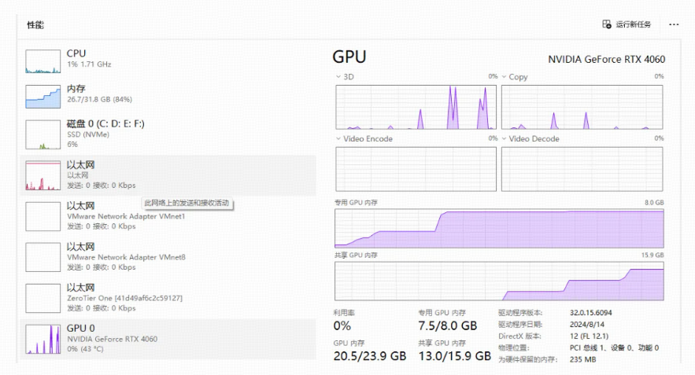

## QWebEngine 被 JS 带崩（附源码复现）

今天的 Web 内容更新带来的惊心动魄的崩溃

由于我们的 Web 内容可以动态线上更新，Web 端的同事直接升级了线上版本。没过多久，后台就收到了大量的 dump 上报内容。大家立马紧张起来，开始分析今天都做了什么事情。唯一的一件事情就是前端升级了一个版本。

我们就立马把 Web 内容拿来本地实测，果然 **100% 奔溃**。我把内容简单化，为了复现场景。

------

## **1) 案发现场（能在 1～3 分钟内触发崩溃）**

```html
<!doctype html>
<html>
<body>
<canvas id="c" width="800" height="600"></canvas>
<script>
const canvas = document.getElementById('c');
const gl = canvas.getContext('webgl');

// Shader
const vs = `
attribute vec2 aPos;
void main(){ gl_Position = vec4(aPos,0.0,1.0); }
`;
const fs = `void main(){ gl_FragColor = vec4(0.4,0.6,1.0,1.0); }`;

// Build program
function makeProgram() {
function sh(type, src) {
    const s = gl.createShader(type);
    gl.shaderSource(s, src);
    gl.compileShader(s);
    return s;
  }
const p = gl.createProgram();
  gl.attachShader(p, sh(gl.VERTEX_SHADER, vs));
  gl.attachShader(p, sh(gl.FRAGMENT_SHADER, fs));
  gl.linkProgram(p);
  gl.useProgram(p);
return p;
}
makeProgram();

const quad = newFloat32Array([-1,-1, 1,-1, -1,1, 1,1]);
const buf = gl.createBuffer();
gl.bindBuffer(gl.ARRAY_BUFFER, buf);
gl.bufferData(gl.ARRAY_BUFFER, quad, gl.STATIC_DRAW);
gl.enableVertexAttribArray(0);
gl.vertexAttribPointer(0, 2, gl.FLOAT, false, 0, 0);

// 🔥 核心泄漏：每帧创建大纹理 + FBO，却不释放
function leakOnce() {
// 2048x2048 约 16MB，一个循环 ≈ 16MB × N
const tex = gl.createTexture();
  gl.bindTexture(gl.TEXTURE_2D, tex);
  gl.texImage2D(gl.TEXTURE_2D, 0, gl.RGBA,
    2048, 2048, 0, gl.RGBA,
    gl.UNSIGNED_BYTE, null);
const fb = gl.createFramebuffer();
  gl.bindFramebuffer(gl.FRAMEBUFFER, fb);
  gl.framebufferTexture2D(gl.FRAMEBUFFER,
    gl.COLOR_ATTACHMENT0,
    gl.TEXTURE_2D, tex, 0);
  gl.drawArrays(gl.TRIANGLE_STRIP, 0, 4);
}

setInterval(leakOnce, 50);
</script>
</body>
</html>
```

## **2) QWebEngine 中的崩溃现场**

当用 Qt/QWebEngine 打开后，会出现以下现象：

- ✔ **20 秒后**

  - `QtWebEngineProcess.exe`
  - GPU 显存从 200MB → 600MB
  - 主界面仍然正常

- ✔ **40 秒后**

  - 显存 > 1GB
  - DevTools 报 GPU 错误、警告

- ✔ **1～2 分钟**
  出现：

  ```
  [.WebGL-000002C57F]GL ERROR :GL_OUT_OF_MEMORY : glTexImage2D:
  ```

- 页面白屏

- webglcontextlost

- ✔ **2～3 分钟**进程直接崩溃：

```
CommandBufferProxyImpl::OnGpuAsyncMessageError
```

## **3) 立马着手调查**

立马让 Web 端同事开始调查，发现 调用的第三方 JS 库忘记释放内存，导致了此次事故。

紧张而刺激的一天就此结束了。

附上一张现场图片：

