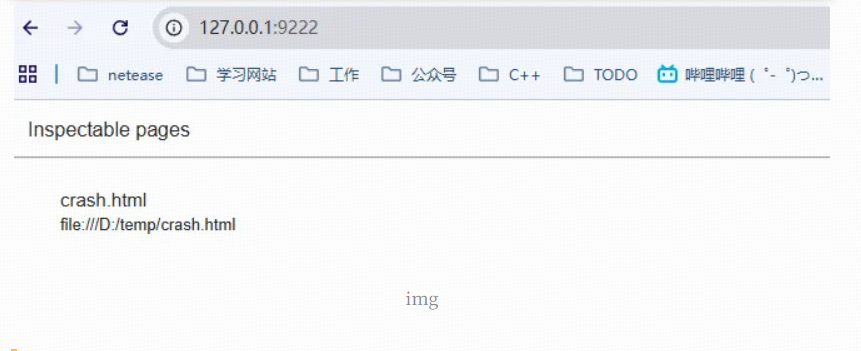
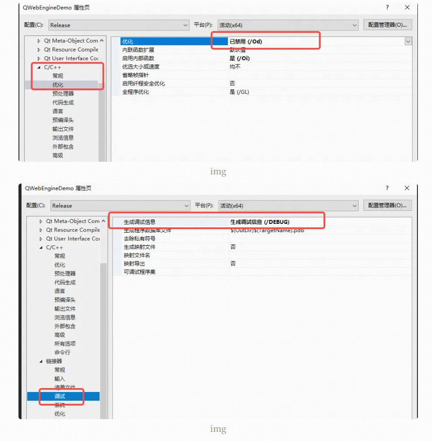

# Qt5 QWebEngine 调试最佳实践指南

最近在项目中遇到很多关于QWebEngine的疑难杂症，越发的发现调试手段的重要性。所以我这里做了一次总结。

总结来说三种：日志输出信息和自带的dev tools，以及远程调试。

## **1、开启日志调试：**

1、Chromium 日志可以帮助排查：

- GPU崩溃
- 渲染进程异常退出
- JS 引擎 V8 崩溃
- 网络加载失败
- 资源加载路径错误
- 渲染降级（从 GPU → 软件渲染）

## **2、操作方法**

### **1、代码配置**

```
#include <QApplication>
#include <QWebEngineView>

int main(int argc, char *argv[])
{
    // 输出日志到 stderr 和 文件
    qputenv("QTWEBENGINE_CHROMIUM_FLAGS",
            "--enable-logging=stderr --v=2 --vmodule=gpu*=2,renderer*=2,v8*=2");

    QApplication app(argc, argv);

    QWebEngineView view;
    view.resize(1200, 800);
    view.load(QUrl("https://www.example.com"));
    view.show();

    return app.exec();
}
```

### **2. 参数说明**

| 参数                      | 作用                                          |
| :------------------------ | :-------------------------------------------- |
| `--enable-logging=stderr` | 输出到控制台                                  |
| `--v=2`                   | 推荐的详细日志等级                            |
| `--vmodule=gpu*=2`        | 打印 GPU 子系统日志（排查 WebGL、黑屏最关键） |
| `renderer*=2`             | 打印渲染进程日志                              |
| `v8*=2`                   | 打印 JS 引擎日志                              |

### **3、问题**

但是这个方案有个问题就是：日志是在控制台看的不能保存文件中。

执行下面的命令就可以将日志重定向到文件中。可以将命令写到bat文件中即可。

```
my_qwebengine_app.exe > D:\logs\qweb_log.txt 2>&1
```

## **2、开启DevTools调试：**

### **1、DevTools 功能**

DevTools = Chrome 的 F12 面板可以用来调试：

- JS 错误
- DOM 结构
- 网络请求（Network）
- 页面性能（Performance）
- 内存泄漏（Memory）
- GPU 渲染监控（Rendering）

### **2、代码配置**

重写`keypressEvent`函数即可，在里面监听F12消息，

```cpp
void MainWindow::keyPressEvent(QKeyEvent *event)
{
    // 检测是否按下F12键
    if (event->key() == Qt::Key_F12)
    {
        qDebug() << "Key_F12";
        QWebEngineView* devToolsView01 = new QWebEngineView();
        m_devToolDlg = QPointer<QWidget>(new QWidget);
        m_devToolDlg->setWindowFlags(Qt::Tool | Qt::X11BypassWindowManagerHint);
        auto layout = new QHBoxLayout;
        layout->setContentsMargins(0, 0, 0, 0);
        m_devToolDlg->setLayout(layout);
        m_devToolDlg->setWindowFlag(Qt::WindowMinMaxButtonsHint);
        m_devToolDlg->setWindowFlag(Qt::WindowStaysOnTopHint);
        auto pt = mapToGlobal(pos());
        m_devToolDlg->setGeometry(pt.x(), pt.y(), width(), height());
        m_devToolDlg->setAttribute(Qt::WA_DeleteOnClose);
        devToolsView01 = new QWebEngineView(m_devToolDlg);
        layout->addWidget(devToolsView01);
        auto source = devToolsView01->page();
        webView->page()->setDevToolsPage(source);
        webView->page()->triggerAction(QWebEnginePage::InspectElement);
        m_devToolDlg->show();
    }
    // 传递其他按键事件给父类处理
    QMainWindow::keyPressEvent(event);
}
```

## **3、开启远程调试(最简单的方案)**

在你的`main`函数代码中**最开始**加入一行代码即可，这是最简单的方案调试。

此时使用浏览器访问端口即可：`http://127.0.0.1:9222`




## **4、使用release版调试：**

在调试过程我们发现Debug的调试速度非常的慢，所以我们切换到`release`版调试，速度就会非常的快。

但是没有在编译的时候，还是需要生成pdb文件。否则很多东西被优化看不到值。



