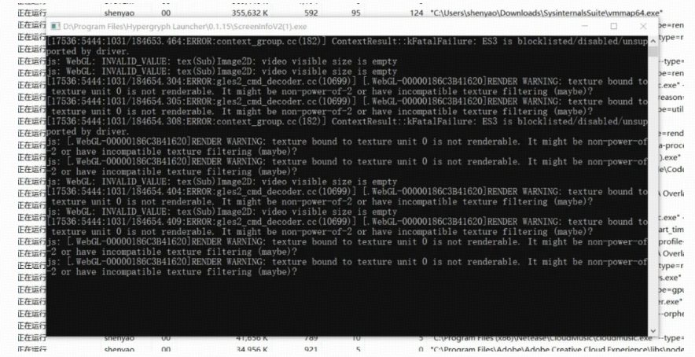

同事反馈我们的程序发生了内存泄漏，高达90G。

听到这里我们震惊了，因为一般的开发机器64G内存就相当可以了。

立马奔赴现场去查看，看到如下的错误信息。



立马查看进程的详细信息，QWebEngine内存确实有90G。同时查看了机器内存，居然有92G内存，机器性能相当的高。

### 1、分析日志内容

#### 1）WebGL2 (ES3) 被 Blocklisted → QWebEngine 强制降级 WebGL1 → 渲染异常

```bat
ContextResult::kFatalFailure: ES3 is blocklisted/disabled/unsupported by driver.
```

含义：

- 你这台机器 **不允许使用 WebGL2 / ES3**
- Chromium（QWebEngine 的底层）把 WebGL2 **强制禁用**
- 页面只能以 **WebGL1（ES2）兼容模式**运行

然后你看到后面大量报错：

```bat
INVALID_VALUE: tex(Sub)Image2D: video visible size is emptyRENDER WARNING: texture bound to texture unit 0 is not renderable
```

这是典型的：

WebGL2 的视频纹理 → 被迫用 WebGL1 → 纹理失败 → 进入错误重试循环

这就会触发：

QWebEngine GPU 进程疯狂创建纹理对象 → 无法复用 → 显存持续泄露这是一个 **已知的 Qt/Chromium bug**
在“ES3 被 blocklist + WebGL1 强制降级 + 视频/大纹理”组合下 100% 触发内存泄漏。

#### 2）为什么泄露无法修复？（重要）

因为这不是传统意义上的内存泄露，而是：

##### 1、Chromium GPU 进程的纹理缓存池不断膨胀

##### 2、由于渲染异常首次发生 → 缓存被标记为不可重用 → 只能继续分配新纹理

##### 3、最终 GPU 内存会无限上涨

并且：

1、清理 JS/WebGL 对象无效

2、关闭 QWebEngineView 无效

3、Qt GC 无效

4、只有杀 GPU 进程才能释放

**解决方案**

时间紧迫，项目到了交付的时间，而且是偶现的问题。

如果从源码角度的分析，如此庞大的项目，保守估计都要一个星期才有眉目。

所以需要一个立马能解决问题的方案。

此时领导就提出了临时的方案：如果QWebEngine 内存超过4G，就认为已经发生了内存泄漏，杀掉进程重启，并上报数据信息便于后期排查。

确实是个简单粗暴的方案，能解燃眉之急。

接下来需要的解决问题就是：监听QWebEngine的**物理内存超过4G**，如果超过4G，则杀掉进程重启。

这里我给出简单的查询物理内存的demo，在项目可以启一个定时器去做这个事情。

```cpp
#include <windows.h>
#include <psapi.h>
#include <iostream>

#pragma comment(lib, "psapi.lib")

// 检查某个进程占用物理内存是否超过指定阈值（字节）
bool CheckProcessMemory(HANDLE hProcess, SIZE_T thresholdBytes)
{
    PROCESS_MEMORY_COUNTERS_EX pmc = {0};
    if (GetProcessMemoryInfo(hProcess, (PROCESS_MEMORY_COUNTERS*)&pmc, sizeof(pmc)))
    {
        SIZE_T workingSet = pmc.WorkingSetSize; // 物理内存占用

        std::cout << "Current WorkingSet: " << (workingSet / (1024.0 * 1024.0 * 1024.0)) << " GB\n";

        if (workingSet >= thresholdBytes)
        {
            std::cout << ">>> Memory Leak Detected! WorkingSet exceed threshold!\n";
            return true;
        }
    }
    else
    {
        std::cerr << "GetProcessMemoryInfo failed.\n";
    }
    return false;
}

int main()
{
    // 当前进程
    HANDLE hProcess = GetCurrentProcess();

    // 设置阈值为 4GB
    const SIZE_T threshold = 4ULL * 1024ULL * 1024ULL * 1024ULL;

    while (true)
    {
        CheckProcessMemory(hProcess, threshold);

        Sleep(2000); // 2秒检测一次
    }

    return 0;
}
```

