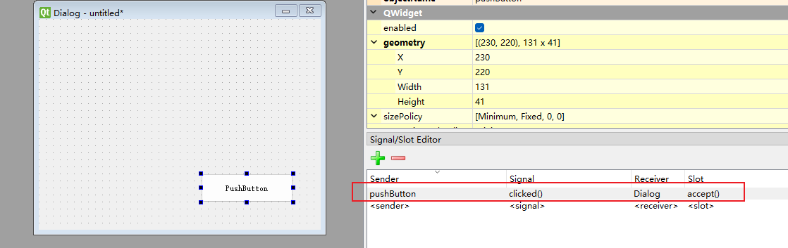
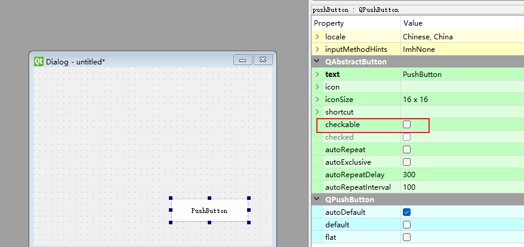

## Qt QPushButton 的几种常见用法

—— Qt Designer 中 clicked 信号、Checkable 按钮、按钮分组

在 Qt 开发中，**QPushButton 是最常用的交互控件之一**。
 但许多初学者只知道它能“点击执行一个槽函数”，却不知道按钮还能有状态、能成组、能当开关用。

本文从三个典型场景来讲：

- Qt Designer 里如何绑定 clicked() 信号
- QPushButton 如何变成 **开关按钮（checkable）**
- 按钮如何 **分组（GroupBox / QButtonGroup）** 形成互斥或多选效果

非常适合作为 Qt 学习系列中的基础篇。

------

## 一、Qt Designer 中使用 clicked() 信号

Qt Designer 提供了最直观的信号与槽绑定方式：**拖拽连接**。

### 1. 打开信号与槽编辑模式

在 Qt Designer 或者 Qt Creator 的 UI 设计器中：

- 点击工具栏最右侧的 **小闪电按钮（信号与槽编辑）**
- 或者按快捷键 **F4**



### 2. 将按钮 clicked() 连接到窗口槽函数

步骤如下：

1. 选择按钮
2. 拖线到主窗口（或其他控件）
3. 在弹出的对话框中选择 **clicked()** 信号
4. 系统会自动在 `mainwindow.h/.cpp` 中生成对应的槽函数声明

生成的槽函数结构类似：

```cpp
void MainWindow::on_pushButton_clicked()
{
    QMessageBox::information(this, "提示", "按钮被点击了！");
}
```

### 3. 优点

- 不需要手敲 connect() 代码
- 适合入门
- 快速、清晰、安全

Qt Designer 的 signal-slot 编辑是初学者最应该掌握的技能。

## 二、Checkable：让按钮变成「开关按钮」

除了普通点击按钮外，Qt 支持让按钮保持“按下 / 释放”的状态，这就是 **Checkable** 按钮。

类似：

- 播放 / 暂停
- 开启 / 关闭
- 显示 / 隐藏
- 选中 / 非选中

### 1. 开启 Checkable

在 Qt Designer 中，选中 button，在右侧属性编辑器找到：


```int
checkable = true
```

也可以通过代码：

```cpp
button->setCheckable(true);
```



### 2. 响应 toggled() 信号

Checkable 按钮常用信号是：

- clicked()：仍然触发（但不推荐用于状态）
- **toggled(bool checked)**：这是“按钮状态改变”事件，必须掌握

示例：

```cpp
connect(ui->btnSwitch, &QPushButton::toggled,
        this, [=](bool checked){
    if (checked)
        ui->btnSwitch->setText("已开启");
    else
        ui->btnSwitch->setText("已关闭");
});
```

### 3. Checkable 的使用场景

- 播放 / 暂停按钮（图标自动切换）
- 切换模式（夜间模式开关）
- 显示 / 隐藏某个面板
- 配置界面中的“开关项”

Checkable 按钮可以让 UI 更智能，更有反馈感。

### 三、按钮分组：Group Button

如果你希望多个按钮形成“互斥”关系或逻辑关系，就需要 **按钮分组**。

按钮分组有两种方式：

### 3.1 QButtonGroup：推荐方式

QButtonGroup 不负责布局，但负责 **逻辑管理**。

#### 1. 创建按钮组

```cpp
auto group = new QButtonGroup(this);
group->addButton(ui->btnA, 1);
group->addButton(ui->btnB, 2);
group->addButton(ui->btnC, 3);
```

给每个按钮一个 ID，便于后期识别。

#### 2. 设置互斥

适用于“单选”按钮（类似单选框）：

```cpp
group->setExclusive(true);
```

点击 A 就不能再点 B 或 C。

适用场景：

- 三选一模式切换
- 工具栏选中效果（例如画笔/橡皮擦/文本工具）
- 侧边栏导航（选中一个，其余取消选中）

#### 3. 监听按钮状态变化

```cpp
connect(group, QOverload<QAbstractButton *>::of(&QButtonGroup::buttonClicked),
        this, [&](QAbstractButton *btn){
    qDebug() << "当前按钮：" << btn->text();
});
```

你也可以监听：

- `idClicked(int id)`
- `buttonPressed`
- `buttonReleased`
- `buttonToggled`

### 3.2 使用 QGroupBox（自动互斥）

如果按钮是 **QRadioButton / QCheckBox**，把它们放在同一个 QGroupBox 中就能自动互斥。

但是 QPushButton **不会自动互斥**。
 所以如果你使用 QPushButton，推荐使用 QButtonGroup 来管理。

## 四、综合示例：三个按钮实现“单选模式切换”

例如三个按钮切换三种模式：“画笔 / 直线 / 橡皮擦”

### Qt Designer 设置：

- 三个 QPushButton
- 设置 checkable = true
- 用 QButtonGroup 编组
- 设置 exclusive = true

### 代码：

```cpp
auto group = new QButtonGroup(this);
group->setExclusive(true);
group->addButton(ui->btnPen, 1);
group->addButton(ui->btnLine, 2);
group->addButton(ui->btnEraser, 3);

connect(group, &QButtonGroup::idClicked, this, [&](int id){
    switch (id) {
    case 1: qDebug() << "画笔模式"; break;
    case 2: qDebug() << "直线模式"; break;
    case 3: qDebug() << "橡皮擦模式"; break;
    }
});
```

## 五、总结

| 功能               | 用法                           | 常见场景                   |
| ------------------ | ------------------------------ | -------------------------- |
| **clicked() 信号** | 通过 Designer 拖线或 connect() | 普通按钮动作               |
| **Checkable 按钮** | setCheckable(true) / toggled() | 开关、模式切换             |
| **按钮分组**       | QButtonGroup + exclusive       | 导航栏、工具栏、三选一模式 |

