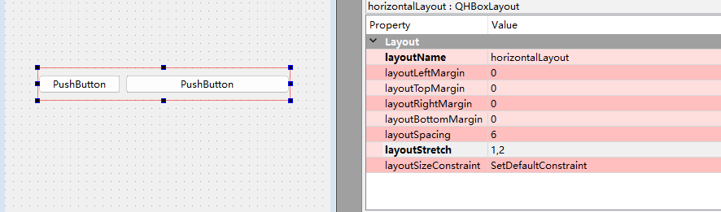
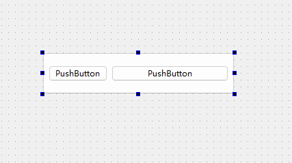
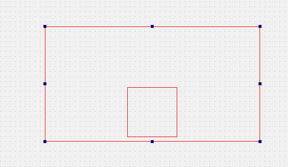

## Qt四种精妙布局

上一篇文章我们说到布局的处理方式，有人反馈说这个太简单了，来点有难度的。

接下来我们思考四个问题：

1、在一个QWidget中如何两个控件所占比例1:2，且不论界面怎么变化。

2、如何在QPushButton中使用布局。

3、我有个背景控件，如何脱离在布局之外。

4、在布局中如何让我的控件在不使用Spacer情况下，居左底部对齐。

这个四个问题是在工程中都遇到的问题，不知道你们是怎么解决的。

### 1、占比问题

这个不是难题，在Qt Designer中布局有个属性`layoutstretch`属性



### 2、QPushButton中增加布局

你可能会想在什么情况下，才会有这样的需求。

考虑下，在UI设计中经常会遇到鼠标经过某个区域时高亮，且整个区域都是热区，里面还包含了其他更小的热区。



修改方案如下：自己手动ui文件，在里面增加一个layout属性，如下面的代码。

```xml
 <widget class="QPushButton" name="pushButton_3">
   <property name="geometry">
    <rect>
     <x>80</x>
     <y>260</y>
     <width>281</width>
     <height>61</height>
    </rect>
   </property>
   <property name="text">
    <string>PushButton</string>
   </property>
     <!--添加layout 属性即可-->
   <layout class="QHBoxLayout" name="horizontalLayout" stretch="1,2">
    <item>
     <widget class="QPushButton" name="pushButton">
      <property name="text">
       <string>PushButton</string>
      </property>
     </widget>
    </item>
    <item>
     <widget class="QPushButton" name="pushButton_2">
      <property name="text">
       <string>PushButton</string>
      </property>
     </widget>
    </item>
   </layout>
  </widget>
```

### 3、控件脱离布局控制

同样需要手动修改ui文件，只要将`label`控件放到`layout`属性之外即可

```xml
 <widget class="QWidget" name="widget" native="true">
   <property name="geometry">
    <rect>
     <x>80</x>
     <y>180</y>
     <width>291</width>
     <height>181</height>
    </rect>
   </property>
   <property name="styleSheet">
    <string notr="true">border:1px solid red;</string>
   </property>
   <layout class="QVBoxLayout" name="verticalLayout">
    <item>
     <widget class="QWidget" name="widget_2" native="true">
      <property name="styleSheet">
       <string notr="true">border:1px solid blue;</string>
      </property>
     </widget>
    </item>
   </layout>
     <!--将控件放到layout布局之外即可-->
   <widget class="QLabel" name="label">
    <property name="geometry">
     <rect>
      <x>0</x>
      <y>0</y>
      <width>100</width>
      <height>30</height>
     </rect>
    </property>
    <property name="text">
     <string>我是游离控件布局之外的控件</string>
    </property>
   </widget>
  </widget>
 </widget>
```

### 4、在布局中控制对齐方式

我想实现如下的方式，该怎么做 。



同样修改UI文件

```xml
   <layout class="QVBoxLayout" name="verticalLayout_2">
    <!--在item节点中加入 alignment="Qt::AlignBottom|Qt::AlignHCenter" -->
    <item alignment="Qt::AlignBottom|Qt::AlignHCenter">
     <widget class="QWidget" name="widget_4" native="true">
      <property name="sizePolicy">
       <sizepolicy hsizetype="Fixed" vsizetype="Fixed">
        <horstretch>0</horstretch>
        <verstretch>0</verstretch>
       </sizepolicy>
      </property>
      <property name="minimumSize">
       <size>
        <width>100</width>
        <height>100</height>
       </size>
      </property>
      <property name="maximumSize">
       <size>
        <width>100</width>
        <height>100</height>
       </size>
      </property>
     </widget>
    </item>
   </layout>
```

